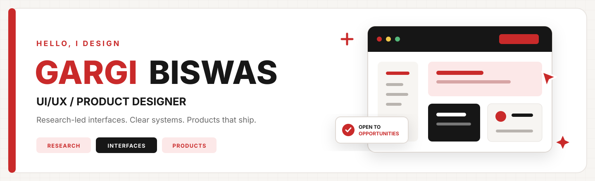
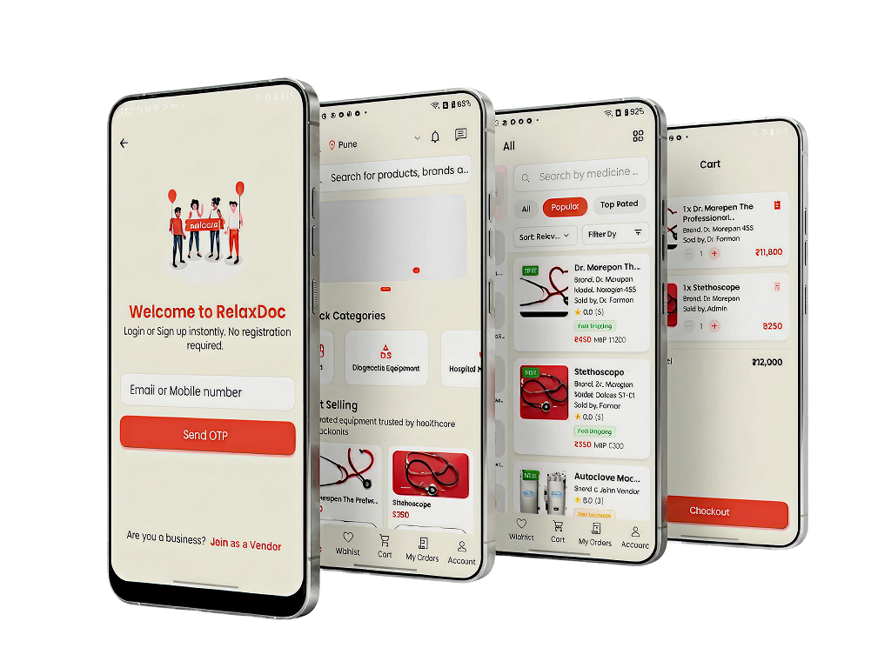
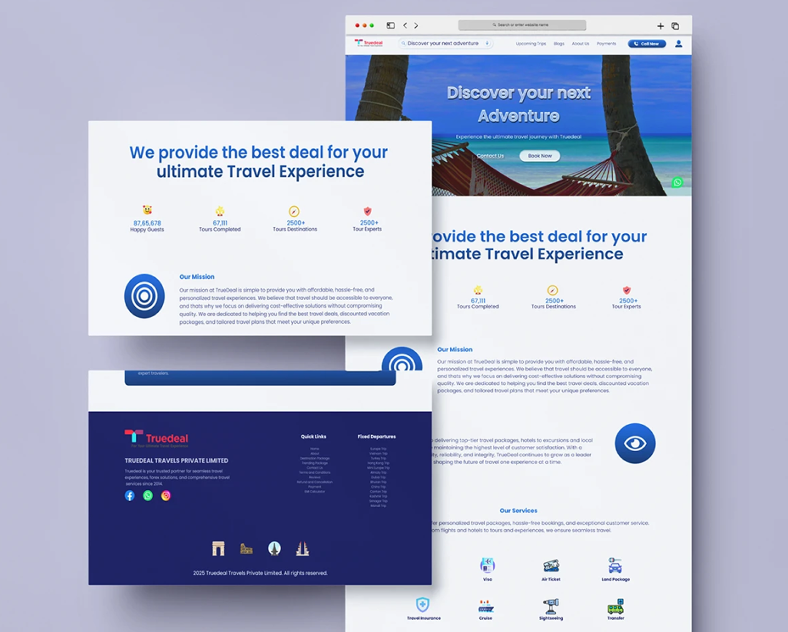
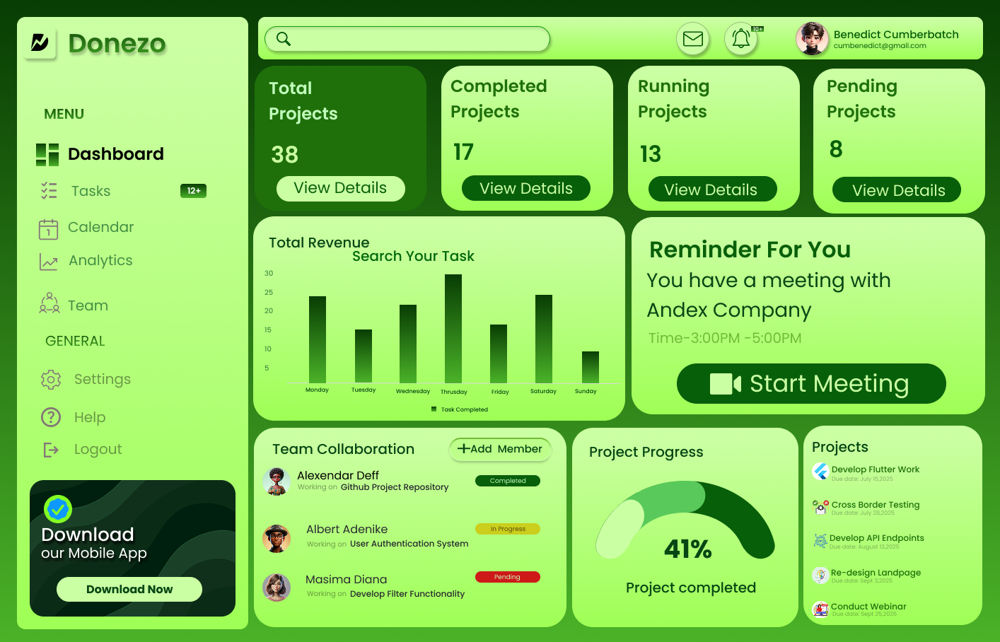
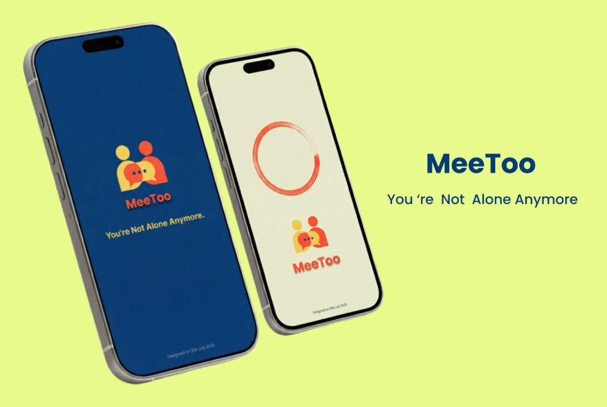

  

<h1 align="center">Gargi Biswas</h1>

  <strong>UI/UX / Product Designer</strong> 
  I turn research, user needs, and complex product ideas into clear interfaces
  that feel thoughtful, useful, and ready to ship.

  
  

  <a href="https://www.behance.net/gargibiswas3">Behance</a>
  &nbsp;&bull;&nbsp;
  <a href="https://www.linkedin.com/in/gargi-biswas-6b5011249/">LinkedIn</a>
  &nbsp;&bull;&nbsp;
  <a href="mailto:gargibiswas1382003@gmail.com">Email</a>
  &nbsp;&bull;&nbsp; India
  &nbsp;&bull;&nbsp; Available worldwide

<table>
  <tr>
    <td align="center" width="33%">
      <h2>10+</h2>
      PROJECTS DESIGNED
    </td>
    <td align="center" width="33%">
      <h2>2</h2>
      DESIGN ROLES
    </td>
    <td align="center" width="33%">
      <h2>1</h2>
      LIVE PRODUCT
    </td>
  </tr>
</table>

## A recruiter shortcut

<table>
  <tr>
    <td width="50%" valign="top">
      <strong>What I bring</strong>  
      Research-led product thinking, structured user flows, responsive
      interfaces, interactive prototypes, scalable design systems, and clear
      developer handoff.
    </td>
    <td width="50%" valign="top">
      <strong>What I am looking for</strong>  
      Full-time UI/UX or Product Designer roles with product-focused teams.
      I am also open to meaningful freelance projects and worldwide remote
      collaboration.
    </td>
  </tr>
  <tr>
    <td width="50%" valign="top">
      <strong>Experience</strong>  
      UI/UX Designer Trainee at InfoObjects Software and UI/UX Designer Intern
      at One Aim IT Solutions.
    </td>
    <td width="50%" valign="top">
      <strong>Education</strong>  
      B.Tech in Computer Science, University of Engineering &amp; Management,
      Jaipur. CGPA: 9.2.
    </td>
  </tr>
</table>

## Live product

<table>
  <tr>
    <td width="48%" valign="middle">
      
    </td>
    <td width="52%" valign="middle">
      <h2>RelaxDoc</h2>
      
<strong>Healthcare mobile platform live on Google Play</strong>

      

        Designed to simplify medical product discovery, ordering, and checkout.
        My contribution covered research, user flows, wireframing, UI design,
        design systems, and the checkout experience.
      

      
<strong>Role:</strong> UI/UX Designer &nbsp;&bull;&nbsp; <strong>Platform:</strong> Android

      <a href="https://play.google.com/store/apps/details?id=com.relaxdoc.health">
        View RelaxDoc on Google Play
      </a>
    </td>
  </tr>
</table>

## Selected work

<table>
  <tr>
    <td width="46%" valign="middle">
      
    </td>
    <td width="54%" valign="middle">
      <h3>TrueDeal Travel Platform</h3>
      

        Responsive booking experiences shaped through UX research, clearer
        flows, and consistent web and mobile interactions.
      

      
<strong>Scope:</strong> UX research &nbsp;&bull;&nbsp; Responsive UI &nbsp;&bull;&nbsp; Booking flows

      <a href="https://www.behance.net/gallery/245873601/Reimagining-the-TrueDeal-Travel-Platform">
        View case study
      </a>
    </td>
  </tr>
  <tr>
    <td width="46%" valign="middle">
      
    </td>
    <td width="54%" valign="middle">
      <h3>Scheduling Dashboard</h3>
      

        A productivity dashboard with clear information hierarchy for meeting
        scheduling, task tracking, and everyday team workflows.
      

      
<strong>Scope:</strong> Dashboard UI &nbsp;&bull;&nbsp; Information hierarchy &nbsp;&bull;&nbsp; Productivity

      <a href="https://www.behance.net/gallery/231679061/Dashboard-Design-for-Scheduling-Meetings-and-Daily-Work">
        View case study
      </a>
    </td>
  </tr>
  <tr>
    <td width="46%" valign="middle">
      
    </td>
    <td width="54%" valign="middle">
      <h3>MEETOO: You Are Not Alone</h3>
      

        An empathy-led experience supporting awareness, safe expression, and
        empowerment for people affected by harassment and abuse.
      

      
<strong>Scope:</strong> UX design &nbsp;&bull;&nbsp; Social impact &nbsp;&bull;&nbsp; Sensitive content

      <a href="https://www.behance.net/gallery/242537013/MEETOO-Youre-Not-Alone-Anymore">
        View case study
      </a>
    </td>
  </tr>
</table>

## Design toolkit

  <strong>UX Research</strong> &nbsp;&bull;&nbsp;
  User Flows &nbsp;&bull;&nbsp;
  Wireframing &nbsp;&bull;&nbsp;
  Prototyping &nbsp;&bull;&nbsp;
  Design Systems &nbsp;&bull;&nbsp;
  Usability Testing &nbsp;&bull;&nbsp;
  Developer Handoff

  Figma &nbsp;&bull;&nbsp; Photoshop &nbsp;&bull;&nbsp; Illustrator &nbsp;&bull;&nbsp; Canva

---

  <h2>Have a thoughtful product in mind?</h2>
  
Let us turn it into an experience people understand and enjoy.

  

    <a href="mailto:gargibiswas1382003@gmail.com"><strong>Start a conversation</strong></a>
    &nbsp;&bull;&nbsp;
    <a href="https://gargibiswas.vercel.app"><strong>Explore the full portfolio</strong></a>
  

